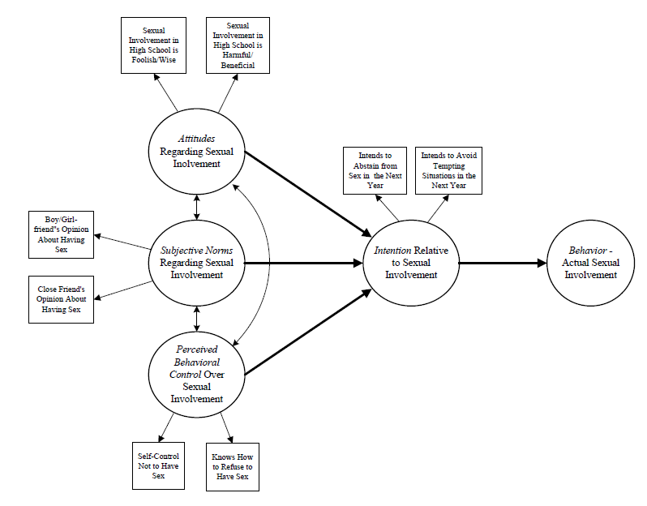
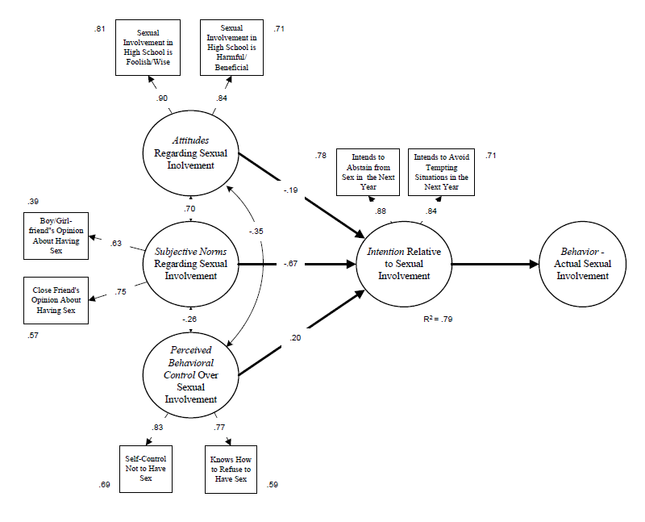

## Introduction 

This document is one of a series designed to illustrate how the R statistical computing environment can be used to conduct various types of social work research. In this report, we present an example of using R and the R *lavaan*  package to conduct a structural equation modeling (SEM) analysis of data collected in a high school teen sexuality needs assessment. 

The SEM process is composed of the following steps and decisions:

1. Construct a path diagram that shows the measurement and structural model of interest
2. Identify the level of measurement for each item and check distributional assumptions 
3. Ensure that the fitting function you chose is based on measurement types (e.g., maximum likelihood for continuous measures, weighted least square for ordinal measures)
4. Move through the model testing process in a logical fashion
  - Fit the model using the appropriate fitting function and carefully assess model fit using a set of popular indexes
  - Once you have established a plausible model, interpret various item level parameters (e.g., loadings, standard errors, R-squared values, error terms, etc.)

We follow these steps in this document.

### SEM model

The data collection instrument was guided by the Theory of Planned Behavior, a popular theory that attempts to explain why people engage in and sustain behaviors (we forgo a lengthy discussion here and leave it to the reader to explore the major tenets, mechanisms, and process of TPB). The path diagram for the TPB is shown below. Two components of a SEM are represented in this diagram: a *measurement* component and a *structural* component. The measurement component is composed of measured variables (indicators in rectangles) linked to latent variables (LVs in ellipses). Testing this part of the model is not unlike conducting a CFA, that is, the paths that run from latent variables to measured variables are factor loadings expressing the strength of the relationship between an indicator and a latent variable. The structural component of the model is represented by the bold arrows that link the latent variables. In this model, the LV 'intention' is the dependent variable and 'attitudes',' norms', and 'control' are the independent variables. The bold arrows that link the LVs are paths expressing the strength and direction of the relationships as regression coefficients. Finally, the two-headed arrows linking the independent LVs represent covariances between each pair. Two final thoughts about the model are worth mentioning. First, it is generally recommended that latent variables are measured by least three indicators. We use two indicators in this example to keep the presentation brief. Second, we did not collect data for the final LV in the model --- behavior --- due to complications in the study. An optimal test of the TPB would include behavioral data. That notwithstanding, testing the model through 'intention' was useful. 

 

The measured variables were:

1. I feel getting involved in a sexual relationship as a teen in high school is: Foolish/Wise
2. I feel getting involved in a sexual relationship as a teen in high school is: Harmful/Beneficial
3. Thinking of your current or a former boyfriend or girlfriend, please tell us how much he/she approves or disapproves of having sex in the next 12 months: Disapproves/Approves
4. Thinking of a close friend (other than boyfriend/girlfriend), please tell us how much he/she approves or disapproves of having sex in the next 12 months: Disapproves/Approves
5. How much self-control do you feel you have to not have sex? No self-control/Complete self-control
6. Do you know how to refuse to have sex? Not at all/Completely
7. What is your my intention about not having sex over the next year: Definitely will have sex/Definitely will not have sex
8. What is your intention about avoiding situations where you might be tempted to have sex: Definitely will not avoid situations/Definitely will avoid situations

Each word pair in the questions were anchors on a seven point measurement scale. These items were identified in the teen pregnancy literature as valid and reliable measures of attitudes, norms, control, and intention, 

## Analysis

```{r setup, include=FALSE}
knitr::opts_chunk$set(echo = TRUE)
```

### Preliminaries

We load *lavaan* and other helpful packages as follows:

```{r load libraries, message=FALSE, warning=FALSE}
## Load Libraries
library(lavaan)
library(dplyr) 
library(tidyr)
library(knitr)
library(mvnormalTest)
```

Next, we load the data file:

```{r load data, message=FALSE, warning=FALSE}
## Load data
data <- read.csv("tpb.csv", header=TRUE)     ## load csv file
head(data)                                   ## list a first few records to check your data set
```

#### Assessing assumptions

An SEM analysis starts wih an assessment about the distribution of measured variables. Specifically, we need to assess the assumption of multivariate normality. We use the *mvnormalTest* package for univariate (Shapiro-Wilk's W) and multivariate normality (Mardia's Multivariate Skewness and Kurtosis tests).

```{r}
mvnout <- mardia(data)
## Shapiro-Wilk Univariate normality test
mvnout$uv.shapiro
## Mardia Multivariate normaility test
mvnout$mv.test
```

Results from both the univariate and multivariate tests indicate that the measures do not come from normally distributed univariate or multivariate distributions (the 'No' results in the table). We address these issues in the following model specification stage.

### Model specification

The R *lavaan* package includes a versatile set of tools and procedures to conduct an SEM analysis. The package was designed to provide applied researchers, teachers, and statisticians a free, fully open-source, but commercial quality package for latent variable modeling. It rivals most proprietary SEM programs in terms of features and capacities --- and it is free. 

The *lavaan* SEM syntax is straightforward. First, we define our model using *lavaan model syntax* then specify technical details for the model in the *sem* function. There are a couple of important considerations in the *sem* specification given characteristics of our data. Because we considered the 7-point scale for each measured variable as continuous and because we found violations of the multivariate normality assumption required for SEM, we used the *lavaan* "MLM' estimator for our fitting function. This estimator uses a maximum likelihood procedure and, importantly, provides robust standard errors and a Satorra-Bentler scaled test statistic, each of which addresses (make corrections for) the multivariate normality violation issues. Note: Problems with non-normal data tend focus on the underestimation of standard errors which leads to rejecting the null hypothesis that a parameter is zero too often, and an inflation of the model chi-square statistic which leads to rejecting models too often.   

```{r SEM model}
## Model specification
model <- '
  attitudes =~ sex.fool + sex.harm
  norms =~ frnd.sex + love.sex
  control =~ self.cntl + how.ref
  intention =~ int.abs + int.avoid
  intention ~ attitudes + norms + control'
## sem function syntax
fit.mod <- sem(model, data=data, std.lv = TRUE, estimator = "MLM")
```

### Model fit

Researchers typically examine model fit statistics before proceeding to interpret parameter estimates. The null hypothesis in an SEM analysis is that the covariance matrix implied or reproduced by the specified model is statistically the same as the input covariance matrix. Contrary to usual hypothesis testing, we hope to *retain* the null hypothesis that the two matrices are statistically the same. 

We start assessing model fit with a chi-square test obtained from *lavaan* output as follows:

```{r chi-square}
fitMeasures(fit.mod, c("chisq.scaled", "df.scaled", "pvalue.scaled"))
```

The Satorra-Bentler scaled chi-square for our model was *X^2^(df)* = 23.827(14), which was statistically significant at the p <= .05 level (pvalue-scaled = .048). In null hypothesis testing terms, we rejected the null hypothesis of no difference between the model implied and actual covariance matrices and concluded there was a difference. While this conclusion is contrary to what we hoped would be accurately reproduced correlations, we know that chi-square is sensitive to sample size and that, given a large sample, even small departures will be significant. Because chi-square is particularly sensitive to sample size, it is the usual practice not to make key decisions about model fit based on the model chi-square statistic alone, but to use a set of fit indexes to make decisions about fit. 

For example, the root mean square error of approximation (RMSEA) is a popular measure of the discrepancy between the model-based and observed correlation matrices. It uses the model chi-square in its computation but makes adjustments based on model complexity (parsimony-adjusted) and has a known sampling distribution so it is possible to compute confidence intervals. We obtained scaled RMSEA values from *lavaan* output as follows:    

```{r rmsea}
fitMeasures(fit.mod, c("rmsea.scaled", "rmsea.ci.lower.scaled", "rmsea.ci.upper.scaled", "rmsea.pvalue.scaled"))
```

Various interpretation RMSEA guidelines have been put forth --- for this example we used an RMSEA <= .05 as the cutoff for close fit; RMSEA = .05 -- .08 as reasonable fit; RMSEA >= .10 as poor fit. Based on the obtained RMSEA point estimate = .045 and the 90% CI [.010, .073], we concluded that the model had an acceptable fit. In fact, the p-value for the test of close fit (p-value = .566) was not significant, which means that the hypothesis of close fit was supported.  

We also used two additional popular fit measures --- the Comparative Fit Index (CFI) and the standardized root mean square residual (srmr) --- to assess model adequacy. The CFI is a member of a family of incremental fit indexes that compare your model to a restricted baseline model. As the name implies, the srmr is based on the actual differences (discrepancies) between the model-based covariances and the actual covariances. We obtained scaled CFI and srmr values from *lavaan* as follows:     

```{r cfi srmr}
fitMeasures(fit.mod, c("cfi.scaled", "srmr"))
```

Various interpretation guidelines for these measures also have been put forth. For this example, we used CFI >= .95 and srmr <= .08 as our threshold values. Based on the thresholds, we concluded that the obtained CFI.scaled value = .99 and srmr = .021 both offered further evidence that our model fit the data reasonably well.

Based on this set of fit measures, we concluded that the model as specified was plausible.   
 
### Measurement model 

Given the acceptable model, we moved to an examination of various parameter estimates. Focusing first on the measurement model, we obtained the estimates from *lavaan* output as follows:  

```{r}
standardizedsolution(fit.mod, type = "std.all", se = TRUE, zstat = TRUE, pvalue = TRUE, ci = TRUE)%>% 
  filter(op == "=~") %>% 
  select(LV=lhs, Item=rhs, Coefficient=est.std, ci.lower, ci.upper, SE=se, Z=z, 'p-value'=pvalue)
```

This output presents standardized coefficients (factor loadings) for items on latent variables (LV), confidence intervals (ci.lower, ci.upper), standard errors (SE), Z values (Wald test), and p-values testing the null hypothesis that a coefficient = 0. Factor loadings ranged from .626 to .897, indicating that the magnitude of the relationships between items and factors were adequate (although there are no strict cutoffs for acceptable loadings). Note that the standard errors are robust meaning that they are corrected for the influences of non-normality. Note also that all the coefficients are statistically significant meaning that null hypothesis that a coefficient = 0 is rejected.   

It also is helpful to examine R2 values are the squared standardized loadings of items. In an SEM, any variable that has an arrow pointing to it is defined as a dependent variable (endogenous variable) and will have an R2 value attached to it. The R2 values shown below for each item indicates the percentage of variance of that item that is explained by the corresponding latent variable. The higher the percentage of variance of an item that is explained by the factor, the better the item is at measuring the factor. We obtained the R2 coefficients from *lavaan* output as follows: 

```{r}
parameterEstimates(fit.mod, standardized=TRUE, rsquare = TRUE) %>% 
  filter(op == "r2") %>% 
  select(Item=rhs, R2 = est) 
```

The R2 values range from .393 to .804. It appears from these values that each item has a substantial relationship with a latent variable. The item with the highest R2 is the 'attitude' item measuring sex is foolish-wise. The item with the lowest R2 is the 'norms' item measuring the perception of a boy/girlfriend opinion about having sex. (Note: There is no strict cutoff for acceptable R2s, but over .50 is desirable and higher is better). 

### Structural model

Next, we focused on the structural model. We obtained the estimates from *lavaan* output as follows:  

```{r Structural model parameters}
standardizedsolution(fit.mod, type = "std.all", se = TRUE, zstat = TRUE, pvalue = TRUE, ci = TRUE)%>% 
  filter(op == "~") %>% 
  select(LV=lhs, Item=rhs, Coefficient=est.std, ci.lower, ci.upper, SE=se, Z=z, 'p-value'=pvalue)
```

This output presents standardized regression coefficients representing relationships between independent latent variables (attitudes, norms, control) and the dependent variable (intention), confidence intervals (ci.lower, ci.upper), standard errors (SE), Z values (Wald test), p-values testing the null hypothesis that a coefficient = 0. A regression coefficient represents the strength of the relationship between an independent variable and the sign represents the direction of the relationship. The strongest relationship is between norms and intention (coefficient = -.667) and the weakest relationship is between attitudes and intention (coefficient = -.189). Because the independent variables are correlated, the repression coefficients are partial coefficients; They are interpreted as the amount of change in the dependent variable given a unit change in the independent variable, controlling for the effects of the other independent variables in the model. The regression coefficients for norms and intention and control and intention are statistically significant while the coefficient for attitudes and intention is not. The R2 for the structural model is .794 which can be interpreted as a proportion of variance explained --- thus attitudes, norms, and control account for 79% of the variance of intention. This would be considered a large effect size.

### Results in a path diagram

It is helpful to display SEM results in a path diagram:



## Conclusions

We interpreted our findings as follows. The overall model was plausible based on various fit indexes (even with a reduced number of measured variables). The TPB constructs were adequately measured by associated indicators based on high factor loadings and R2 values. The structural relationships between latent variables varied with norms having the highest partial regression coefficient. Overall, the model accounted for 79% of the variance of intention. 

The use of the TPB underscores a key aspect of SEM; It is best to assess a model in the context of a theory. Like confirmatory factor analysis, SEM generally is a confirmatory method where the goal is to support or disconfirm a model based on a theory of interest. Social work uses a wide range of theories ranging from theories about individual behavior (like TPB) to theories about larger scale social issues. SEM offers a potent set of tools for testing our theories which should become a part of any social work researcher's toolkit.

A good reference for social work researchers:

Bowen, N.K. & Guo, S. (2012). *Structural equation modeling.* New York, NY: Oxford University Press (a Pocket Guide to Social Work Research Methods)

